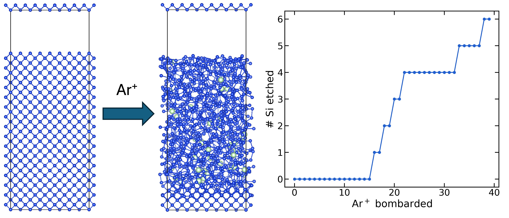

# Si Plasma Etching — MACE + LAMMPS/Kokkos + tfMC

MD simulations of Ar⁺ sputtering and Cl2/Ar⁺ atomic layer etching (ALE) on a Si(100) slab, driven by Foundational MACE-MLIP through LAMMPS.

## Directories

| Directory | Process | Relaxation |
|---|---|---|
| `Sputtering_MACE` | Ar⁺ sputtering only | plain MD (NVE + Berendsen cooling) |
| `Sputtering_MACE_tfMC` | Ar⁺ sputtering only | MD + tfMC-accelerated relaxation (`fix tfmc`) after each impact |
| `ALE_MACE` | Cl₂ dose cycles then Ar⁺ sputter cycles | plain MD (NVE + Berendsen cooling) |
| `ALE_MACE_tfMC` | Cl₂ dose cycles then Ar⁺ sputter cycles | MD + tfMC-accelerated relaxation (`fix tfmc`) after each event |

## Build requirements

- **LAMMPS built with the KOKKOS package** (CUDA backend) — needed to run `pair_style mliap unified`.
- **ML-IAP package** with the unified (Python/PyTorch) interface, to load the MACE model as `pair_style mliap unified <model>.pt 0`.
- **MC package** (`fix tfmc`) — only needed for the `_tfMC` variants, which use time-stamped force-bias Monte Carlo for accelerated relaxation between events instead of plain MD.

## Workflow

1. **Setup**: `in_cpu.lammps` builds a diamond-lattice Si slab, fixes the bottom layer (`anchor`), and loads the MACE potential via `pair_style mliap unified`.
2. **Event loop**: each iteration deposits one Ar⁺ ion (and, for ALE, alternates in Cl₂ dose cycles), runs MD, then cools with a Berendsen thermostat. The `_tfMC` variants replace/follow this with a `fix tfmc` relaxation phase before the next event.
3. **Cleanup**: `delete_atoms region del` removes atoms that end up back near the injection height after each event (sputtered/un-embedded species).
4. **Post-processing**: run `python convert.py` after the LAMMPS job finishes to produce `trajectory.extxyz` and VASP structure files from `dump_cpu.lammpstrj`.

## References

1. A. Kounis-Melas, J. R. Vella, A. Z. Panagiotopoulos, and D. B. Graves,  
   "Deep potential molecular dynamics simulations of low-temperature plasma-surface interactions,"  
   *Journal of Vacuum Science & Technology A*, **43**(1), 2025.
